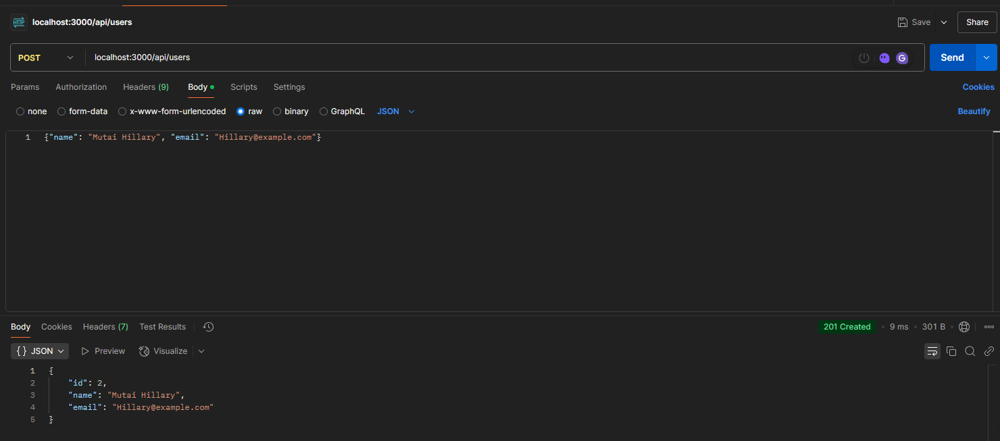
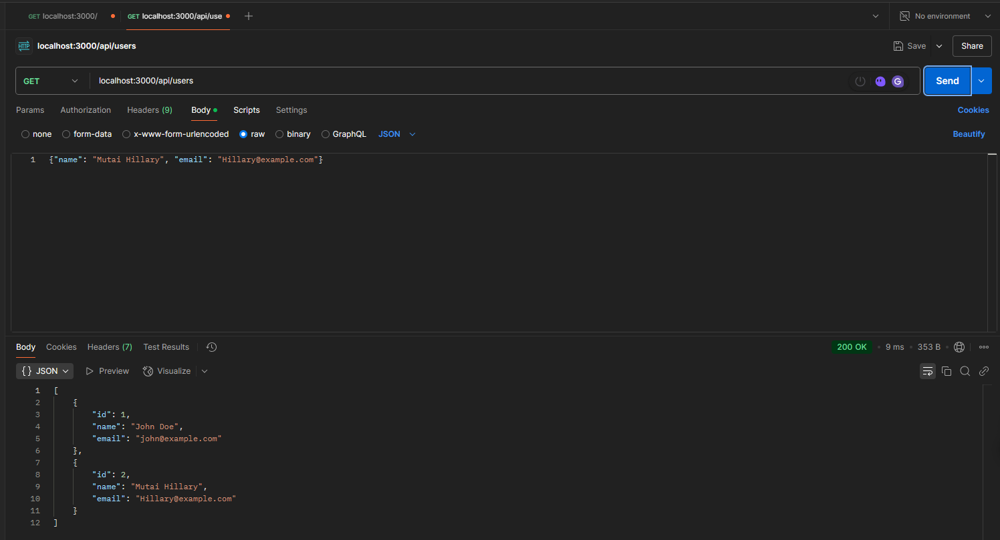
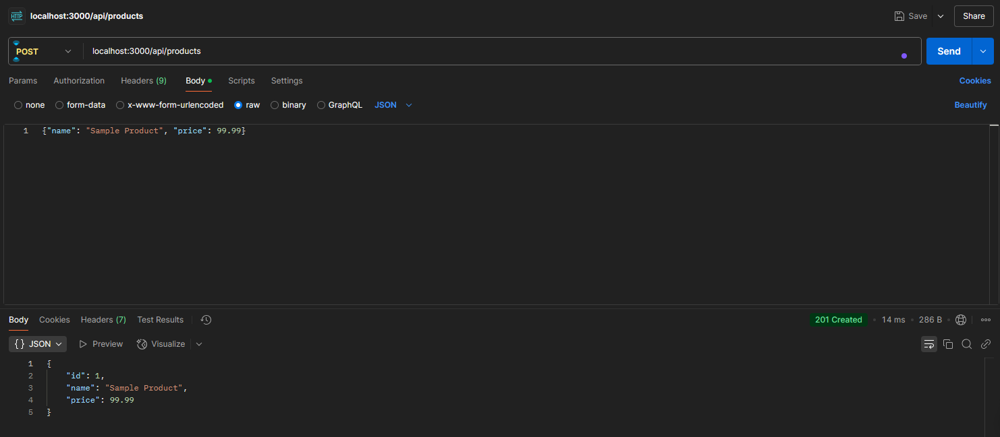
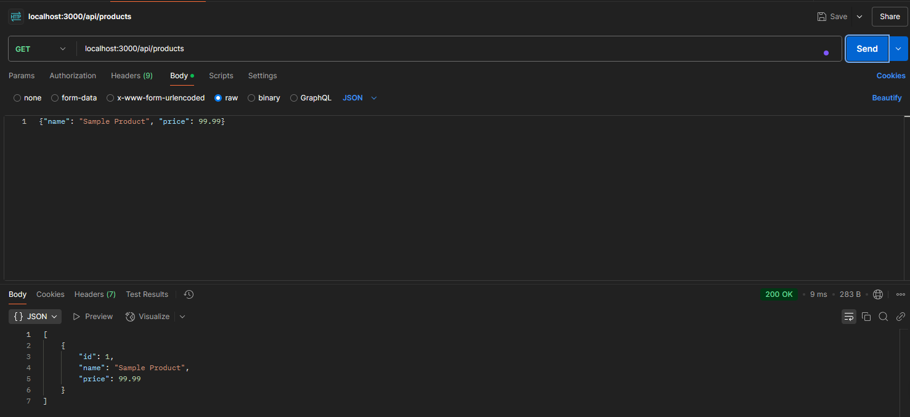
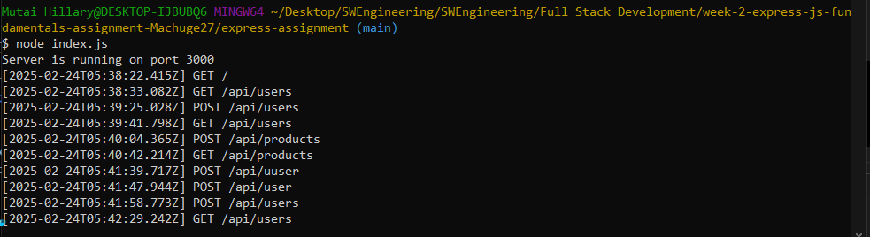

# Express.js Assignment

This project implements a RESTful API using Express.js with routes for managing users and products.

## Setup Instructions

1. Install dependencies:
```bash
npm install
```

2. Create a `.env` file in the root directory with the following content:
```
PORT=3000
NODE_ENV=development
```

3. Start the server:
```bash
node index.js
```

## API Endpoints

### Users

- `GET /api/users` - Get all users
- `POST /api/users` - Create a new user
- `GET /api/users/:id` - Get user by ID
- `PUT /api/users/:id` - Update user by ID
- `DELETE /api/users/:id` - Delete user by ID

### Products

- `GET /api/products` - Get all products
- `POST /api/products` - Create a new product
- `GET /api/products/:id` - Get product by ID
- `PUT /api/products/:id` - Update product by ID
- `DELETE /api/products/:id` - Delete product by ID

## Example Requests

### Create a User
<!-- ```bash
curl -X POST http://localhost:3000/api/users \
  -H "Content-Type: application/json" \
  -d '{"name": "John Doe", "email": "john@example.com"}'
``` -->




### Create a Product
<!-- ```bash
curl -X POST http://localhost:3000/api/products \
  -H "Content-Type: application/json" \
  -d '{"name": "Sample Product", "price": 99.99}'
``` -->






## Project Structure

```
express-assignment/
│-- routes/
│    ├── userRoutes.js
│    ├── productRoutes.js
│-- middleware/
│    ├── logger.js
│-- controllers/
│    ├── userController.js
│    ├── productController.js
│-- index.js
│-- package.json
│-- README.md
│-- .env
```

## Features

- RESTful API implementation
- Custom logging middleware
- Global error handling
- Environment variable configuration
- Separate route and controller logic
- In-memory data storage